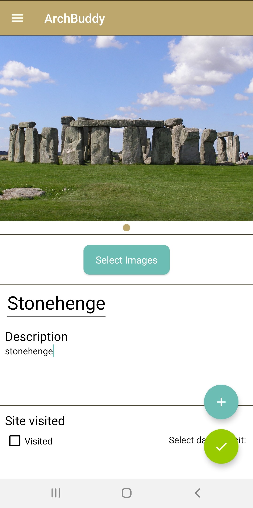

# ArchBuddy
Mobile Application created for Android Programming with Kotlin class.
Concept is to help archaeology students discover new sites.

# User Interface

# Features:
- Site List
- Site Create
- Site Edit
- Splash Screen
- Sign Up/ Login
- Logout
- Settings
- Multiple Images
- Visited & Date Visited
- Notes
- Edit Location
- Map of Sites
- Favourites
- Ratings
- Navigation Drawer
- Landscape Support
- FireBase Auth, DB, and Storage,
